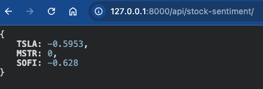
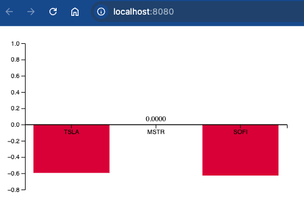

# WallStreetBets NLP Sentiment Analyzer

This program extracts the latest data from the WallStreetBets subreddit and performs sentiment analysis to identify which stocks are popular at the moment.

### Key Features & Tasks

- **API Integration**:
    - Utilized external API endpoints, including Reddit's API via Python PRAW library and the Financial Modeling Prep API, to gather data on stock symbols and company names within US markets (NYSE and NASDAQ).
    
- **Data Cleaning & Preprocessing**:
    - Developed multiple functions to clean raw JSON data, making it usable within the program.
    - Created functions to normalize company names as users often refer to them in a simplified form. For example, Reddit users typically say "Boeing" instead of "The Boeing Company" or "Rivian" instead of "Rivian Automotive, Inc."
    - Implemented methods to parse out punctuation, possessive forms (e.g., "'s"), and other unnecessary elements, leaving only the company name. This ensures consistency and accounts for variations in how people refer to stocks.

- **Unit Testing**:
    - Developed unit tests for key functions to ensure reliability and performance across the project.
    - Wrote Python scripts to automate testing of individual functions.

- **Sentiment Analysis**:
    - Integrated the VADER sentiment analysis library to assess the sentiment of Reddit post titles and text bodies. This provides a general outlook on a particular stock based on user posts.
    
- **Database Management**:
    - Designed the SQL schema using the Django framework and connected it to a PostgreSQL database.
    - Created the necessary data models and schema to store the extracted stock data and their associated sentiment.

- **API Development**:
    - Built REST API endpoints using Django REST Framework:
        - An endpoint to fetch all data collected so far.
        - An endpoint to fetch data specific to the current day (used for the frontend dashboard).
        
- **Frontend Development**:
    - Used TypeScript to send a request to the Django API and retrieve data for the current day.
    - Implemented an `await/fetch` request to handle the data and pass it to a D3.js-based graph for visualization.
    - Developed a dashboard where users can visualize stock data and sentiment trends over time.

- **Version Control**:
    - Strengthened version control skills throughout the project by managing multiple branches and collaborating with others through Git and GitHub.

### Notes:

- Both the Django server (inside the `sentimental_analysis` directory) and the frontend dashboard (inside the `stock-sentiment-dashboard` directory) must be active for the full application to run.
    - To start the Django server: `python3 manage.py runserver`
    - To start the frontend dashboard: `npm run start`

---

This program is a full-stack implementation that integrates APIs, processes data, and presents it visually, providing insights into stock popularity on WallStreetBets.

Final Data processed by backend which is given to frontend:

Data Visuals processed by frontend with given data:

# Goals:
- Python
- TypeScript
- d3.js
- APIs
- Version Control
- Django
- REST APIs
- Natural Language Processing
- Celery Task Automater
- Webscraping with Pandas

# APIs used: 
- Reddit API
- Finnhub API
- Financial Modeling Prep API (using this over finnhub because of better data)
